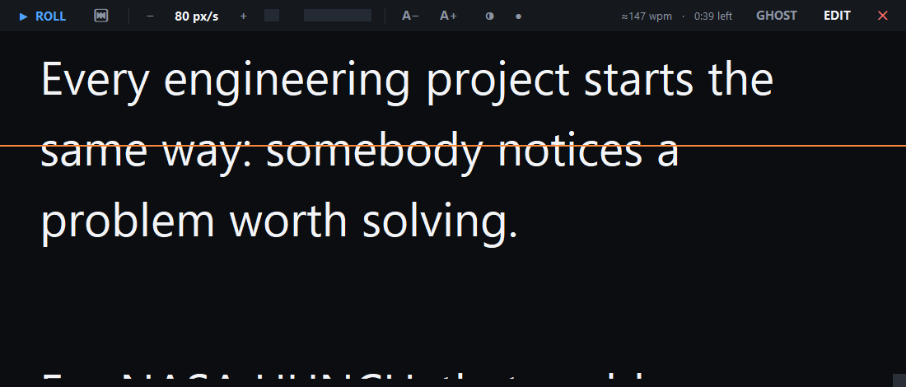
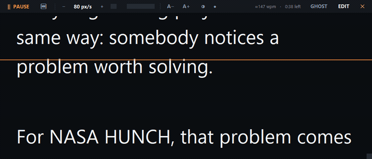

# Overlay Teleprompter

**Read your script while you look straight down the lens.** A frameless, always-on-top prompter that floats over OBS, Camtasia, Zoom, or anything else on screen, and is driven entirely by global hotkeys so you never have to click back into it mid-take.

No installers, no dependencies, no accounts. Standard-library Python only, about 600 lines, one file.

## Rolling

Text rolls at a speed you set in pixels per second, with a live words-per-minute estimate and a countdown of time left in the bar. The orange line marks where to read. Hit `Ctrl+Alt+Space` from inside your recording app and it starts after a three-second countdown.

## Setup

1. Put `teleprompter.pyw`, `Create-Shortcut.ps1`, and `Install Teleprompter.bat` in one folder you intend to keep, for example `C:\Tools\Teleprompter`.
2. Double-click **Install Teleprompter.bat**.
3. That creates a Desktop shortcut, a Start Menu entry, and binds **Ctrl+Alt+P** as the launch hotkey.

If Python is not installed, grab it from python.org and tick "Add python.exe to PATH" during setup, then run the installer again.

## Controls

| Action | In the window | Works anywhere |
|---|---|---|
| Roll / pause | `Space` | `Ctrl+Alt+Space` |
| Faster | `Up` | `Ctrl+Alt+Up` |
| Slower | `Down` | `Ctrl+Alt+Down` |
| Back to top | `Home` | `Ctrl+Alt+Home` |
| Click-through on/off | `GHOST` button | `Ctrl+Alt+T` |
| Skip back / forward | `PgUp` / `PgDn` | |
| Font size | `Ctrl +` / `Ctrl -` | |
| Edit script | `Ctrl+E` | |
| Open / save script | `Ctrl+O` / `Ctrl+S` | |
| Quit | `Esc` | |

The global hotkeys are the important ones. Once you hit record and click into OBS or Camtasia, this window no longer has focus, and `Ctrl+Alt+Space` is what starts the roll without you touching the mouse.

Conversational delivery lands around 140 to 160 wpm. Set the speed once with your actual script loaded and the wpm readout will tell you whether the pace matches how you talk.

## Recording workflow

1. Launch with `Ctrl+Alt+P`.
2. Click **EDIT**, paste your script, click **START**.
3. Drag the top bar so the text sits directly under your webcam lens. The closer the reading line is to the lens, the less your eyes drift off camera. The orange line marks where to read.
4. Set opacity with the two circle buttons so you can still see your framing behind the text.
5. Press **GHOST** or `Ctrl+Alt+T`. The window stays visible but clicks pass straight through to whatever is behind it, so you can drive OBS without moving the prompter.
6. Hit record, then `Ctrl+Alt+Space`. There is a three-second countdown before the text starts moving.

Everything you set persists to `%APPDATA%\OverlayTeleprompter\config.json`, including your script, so the app reopens exactly as you left it.

## Notes

- The prompter window is captured by screen recorders and by full-screen capture in OBS. If you are recording your screen rather than just a camera, add OBS as a **Window Capture** source of the app you are demoing instead of a Display Capture, and the prompter stays out of the footage while remaining visible to you.
- Click-through and the global hotkeys use the Windows API. On macOS or Linux the app still runs, but you control it from the window itself.

## License

MIT. See [LICENSE](LICENSE).
